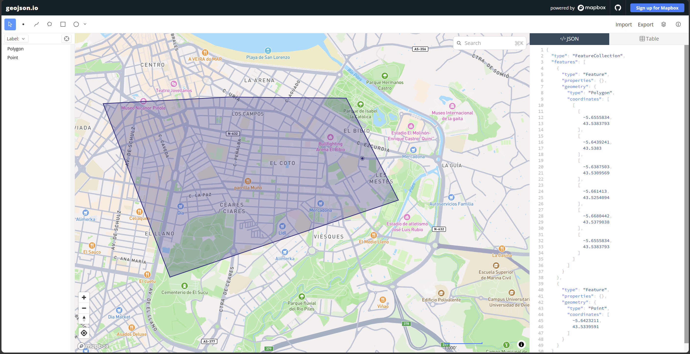
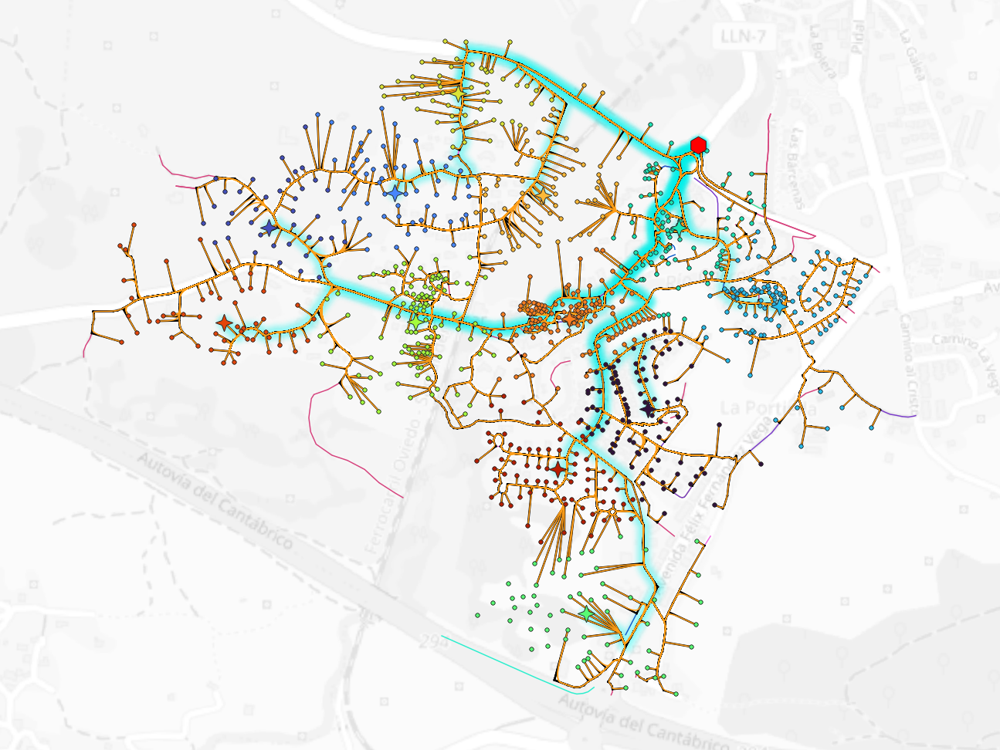
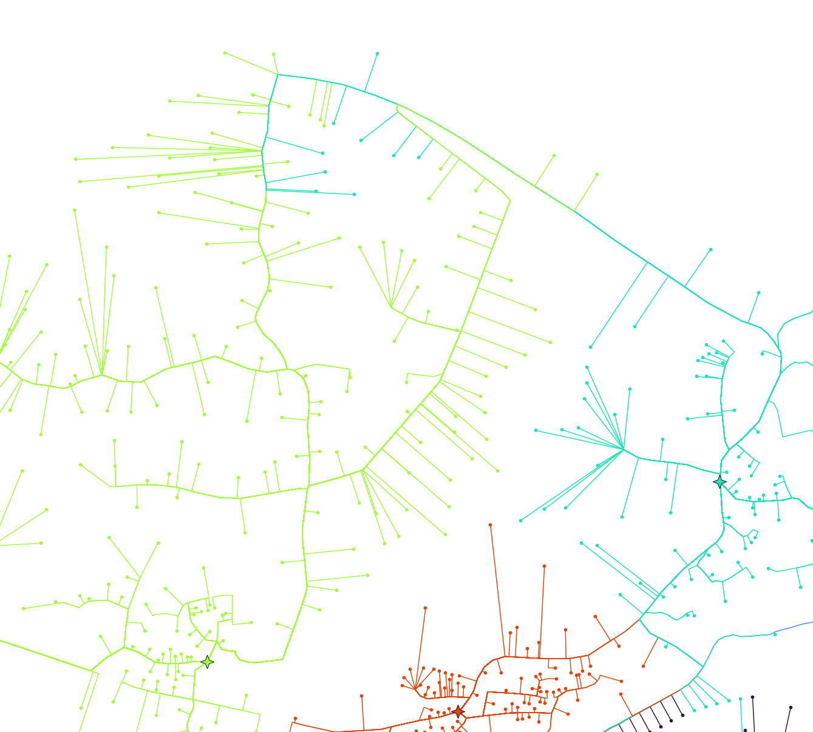
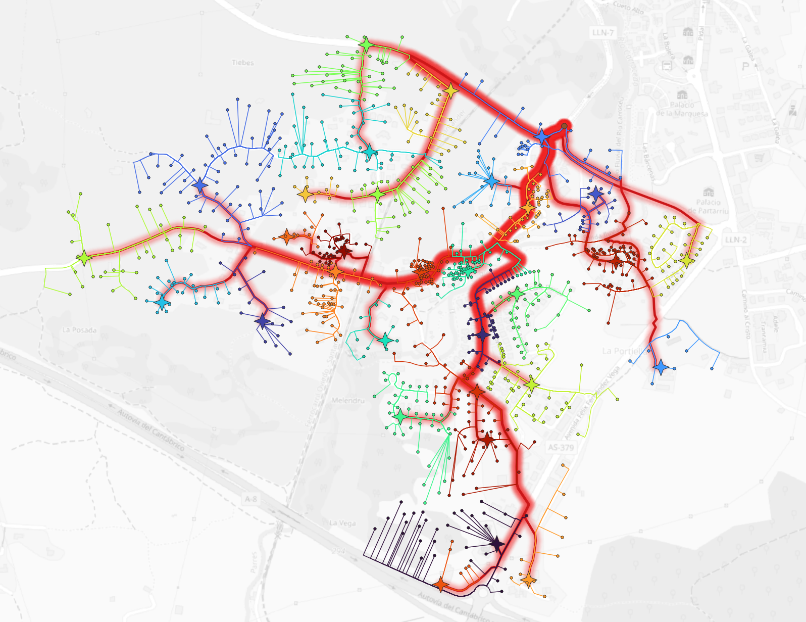

# Herramienta de despliegue FFTH automatizado.

Está en proceso, pero tiene buena pinta.

# Pasos para utilizarlo.

Primero debemos extraer el area de cobertura deseada en un geojson y establecer el punto del OLT. Personalmente, me gusta la página [geojson.io](https://geojson.io/next/). Se define un polígono junto a un punto y se copia la salida del archivo en un archivo geojson, tal y como se ve en la figura. [Aquí](https://github.com/mapbox/geojson.io) se puede encontrar el repositorio del proyecto, gracias a sus creadores.

Una vez tengamos el area de cobertura, especificamos en el código su directorio y el nombre y directorio del archivo de salida. Personalmente me gusta tener ambos en carpetas separadas `areas_cobertura` y `out` respectivamente.

Una vez definido esto, ejecutamos el código y saldrá una ventana emergente que nos permitirá tener una vista previa de como quedará el despliegue. Si estamos contentos a priori, podremos abrir el archivo `.gpkg` en un programa SIG como QGIS para hacer una edición manual de los nodos, fibras o canalizaciones en el caso de ser necesario. Generalmente, es preferible partir de un buen despliegue automatizado inicial antes que realizar muchos ajustes en el SIG, no queda más remedio que probar a cambiar parámetros como el número de clusters o la posición del OLT hasta dar con una que se acerque lo máximo posible a la red deseada.

# Como funciona.

# Diario de desarrollo.

Si usamos el algoritmo k-medias nos queda algo así.

El problema es que ciertos nodos que se encuentran cerca en línea recta, comparten clúster, estando los caminos hacia estos demasiado lejos, además si se hace de esta manera no se hace una canalización eficiente de la red troncal porque las canalizaciones públicas irían en algunos casos en dirección contraria a la red troncal, sumando metros haciendo esa "U", además de perjudicar la calidad de la señal al hacer un giro de 180 grados.

Sigue habiendo problemas de solapamiento en los clústeres en la elección de grupos según las carreteras, como se ve en la foto de abajo. Además, hay que poner un tope al número máximo de usuarios que puede abastecer un único CTO porque el algoritmo tal y como está reparte la carga fatal. 

### Híbrido Voronoi topológico - K medias

Cambio de algoritmo a otro bastante extraño y de nicho pero que funciona bastante bien. Es un Voronoi, pero en vez de ser espacial, es topológico, osea que se propaga por la red que interconecta los nodos entre ellos.

La ventaja de usar este algoritmo frente a otros como k-medioids, k-means o Dijisktra, es que aparte de respetar la distancia topológica más corta hacia los CTOS, evita que se entrelacen. Al funcionar propagando un frente de ondas desde el cto en todas direcciones, en el momento que dos frentes colisionan, se para la propagación, así que nunca se cruzan.

Abajo se adjunta una captura de un despliegue totalmente automatizado sin cambios manuales.

Como se puede ver, los clústers están bien recogidos y aislados, con distancias a sus nodos coherentes.

No todo es perfecto, en cuanto a los fallos veo que, por ejemplo, abajo hay un cto naranja aislado dentro del clúster negro. Esto ocurre porque la elección de los CTO se hace ejecutando el algoritmo k-medias tradicional.

Otro "fallo" por ejemplo, en el cluster verde de la izquierda, el cto está muy a la izquierda, provocando que la distancia que deben recorrer las fibras es mayor que si se encontrase en el centro o a la derecha.

El fallo más significativo de este método es que tienes un control muy pobre de la demanda de portales por cada CTO.

La solución a estos problemas, aunque suene un poco a cuento de la vieja, es modificar los clústers a mano, tanto para optimizar la posición del CTO, como cambiar el ``id_cluster`` de algunos portales, como eliminar o añadir algún que otro CTO. 

Por supuesto que se podría refinar el algoritmo, pero siempre va a haber algún caso que lo rompa o que requiera igualmente de cierto retoque por las carácteristicas del proyecto, así que como por ahora parece funcionar bien, se deja así porque los retoques manuales resultan mínimos.